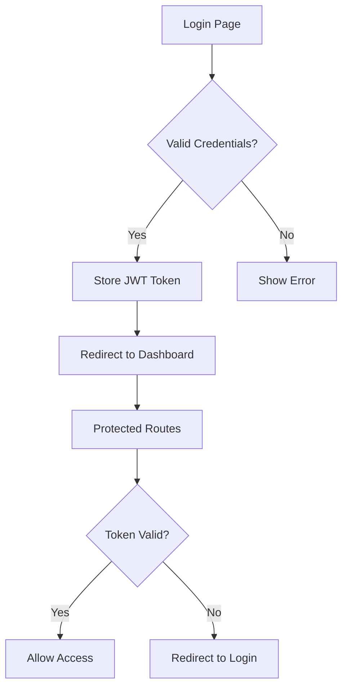

# 🎓 Beasiswa Platform - Frontend

<div align="center">
  
  
  
  
</div>

<div align="center">
  <h3>🚀 Frontend untuk Platform Manajemen Beasiswa Non-APBN Universitas Andalas</h3>
  <p>User interface modern dan responsif untuk sistem manajemen beasiswa universitas</p>
</div>

---

## ✨ Fitur Frontend

### 👨‍💼 Admin Dashboard

- 📊 **Dashboard Analytics** dengan charts dan statistik
- 👥 **Manajemen User** dengan table interaktif
- 🏛️ **Master Data** untuk fakultas dan departemen
- 🎯 **CRUD Beasiswa** dengan form validation

### 👨‍🎓 Portal Mahasiswa

- 📝 **Form Pengajuan** yang user-friendly
- 📄 **Upload Dokumen** dengan drag & drop
- 📈 **Status Tracking** real-time
- 🔔 **Notification Center**

### 🔍 Interface Verifikator

- 📋 **Review Dashboard** untuk dokumen
- 💬 **Comment System** terintegrasi
- ✅ **Approval Workflow** yang jelas

---

## 🛠️ Tech Stack

- **⚛️ React 18** - Modern UI library dengan hooks
- **⚡ Vite** - Lightning fast build tool
- **🎨 Ant Design** - Enterprise-class UI components
- **🛣️ React Router DOM** - Declarative routing
- **📡 Axios** - Promise-based HTTP client
- **🎯 React Hook Form** - Performant forms
- **🔐 JWT Decode** - Token management
- **📱 Responsive Design** - Mobile-first approach

---

## 📁 Struktur Proyek

```
frontend-beasiswa/
├── 📂 public/
│   ├── 🖼️ favicon.ico
│   └── 📄 index.html
├── 📂 src/
│   ├── 📂 components/           # Reusable components
│   │   ├── 📂 Layout/          # Layout components
│   │   ├── 🧩 Button.jsx       # Custom button
│   │   ├── 📊 Table.jsx        # Universal table
│   │   └── 📝 Modal.jsx        # Universal modal
│   ├── 📂 pages/               # Page components
│   │   ├── 📂 admin/           # Admin pages
│   │   ├── 📂 mahasiswa/       # Student pages
│   │   ├── 📂 verifikator/     # Verifier pages
│   │   └── 📂 auth/            # Authentication pages
│   ├── 📂 services/            # API services
│   │   ├── 🔧 apiConfig.js     # API configuration
│   │   ├── 🔐 tokenAuth.js     # Auth utilities
│   │   └── 📡 *.Service.js     # Service modules
│   ├── 📂 utils/               # Helper functions
│   ├── 📂 hooks/               # Custom React hooks
│   ├── 📂 assets/              # Static assets
│   ├── 🎯 App.jsx              # Main App component
│   └── 🚀 main.jsx             # Entry point
├── 📄 package.json
├── ⚙️ vite.config.js
└── 📄 README.md
```

---

## 🚀 Quick Start

### Prerequisites

- 📋 Node.js (v20+)
- 📦 npm atau yarn

### 1️⃣ Clone & Install

```bash
git clone https://github.com/username/beasiswa-platform-frontend.git
cd beasiswa-platform-frontend
npm install
```

### 2️⃣ Environment Setup

```bash
# Copy environment template
cp .env.example .env

# Edit .env file
VITE_API_BASE_URL=http://localhost:3000/api
VITE_APP_NAME=Beasiswa Platform
```

### 3️⃣ Development

```bash
# Start development server
npm run dev

# Open browser
# http://localhost:5173
```

---

## 🔧 Available Scripts

```bash
# Development
npm run dev          # Start dev server

# Building
npm run build        # Build for production
npm run preview      # Preview production build

# Code Quality
npm run lint         # Run ESLint
npm run lint:fix     # Fix ESLint issues

# Testing
npm run test         # Run tests
npm run test:ui      # Run tests with UI
npm run coverage     # Generate coverage report
```

---

## 🎨 Component Library

### Universal Components

```jsx
// Universal Table with filters & search
<UniversalTable
  title="Data Mahasiswa"
  data={students}
  columns={columns}
  searchFields={['nama', 'nim']}
  addButtonText="Tambah Mahasiswa"
  onAdd={handleAdd}
/>

// Universal Modal for forms
<UniversalModal
  visible={modalVisible}
  title="Tambah Data"
  fields={formFields}
  onSubmit={handleSubmit}
  loading={loading}
/>

// Custom Button with variants
<Button
  variant="primary"
  size="large"
  loading={isLoading}
  icon={<PlusOutlined />}
>
  Tambah Data
</Button>
```

### Layout System

- **AdminLayout** - Layout untuk halaman admin
- **StudentLayout** - Layout untuk mahasiswa
- **AuthLayout** - Layout untuk authentication

---

## 🔐 Authentication Flow



---

## 📱 Responsive Design

- **🖥️ Desktop**: Full feature set dengan sidebar navigation
- **📱 Mobile**: Collapsible menu dengan touch-friendly interface
- **📐 Tablet**: Optimized layout untuk portrait/landscape

---

## 🎯 State Management

### Local State (useState, useReducer)

- Form states
- Modal visibility
- Loading states
- Filter & search states

## 🔌 API Integration

### Service Layer Pattern

```jsx
// services/studentService.js
export const getStudents = async () => {
  const response = await authFetch("/students");
  return response.data;
};

export const addStudent = async (studentData) => {
  const response = await authFetch("/students", {
    method: "POST",
    body: JSON.stringify(studentData),
  });
  return response.data;
};
```

---

## 🎨 Styling & Theming

### Ant Design Theme

```jsx
// Custom theme configuration
const theme = {
  token: {
    colorPrimary: "#1890ff",
    borderRadius: 6,
    fontSize: 14,
  },
  components: {
    Button: {
      primaryColor: "#fff",
    },
  },
};
```

### CSS Modules & Styled Components

- Component-scoped styling
- Theme-aware styling
- Responsive utilities

---

## 📦 Build & Deployment

### Production Build

```bash
npm run build
# Output di folder dist/
```

### Deployment Options

```bash
# Static hosting (Netlify, Vercel)
npm run build && npm run preview

# Docker
docker build -t beasiswa-frontend .
docker run -p 80:80 beasiswa-frontend

# Nginx
cp dist/* /var/www/html/
```

---

### Integration Testing

- API integration tests
- Form submission flows
- Navigation testing

---

## 🤝 Contributing

1. Fork the repository
2. Create feature branch: `git checkout -b feature/amazing-feature`
3. Follow coding standards:

   ```jsx
   // Use functional components with hooks
   const MyComponent = ({ prop1, prop2 }) => {
     const [state, setState] = useState(initialState);

     return <div className="my-component">{/* JSX content */}</div>;
   };
   ```

4. Write tests for new features
5. Submit pull request

---

## 📄 Related Repositories

- 🔧 **Backend API**: [beasiswa-platform-backend](https://github.com/paybackretr0/backend-beasiswa-platform)

---

<div align="center">
  <p>Built with ⚛️ React & ❤️ for better user experience</p>
  <p>⭐ Star this repo if you find it useful!</p>
</div>
